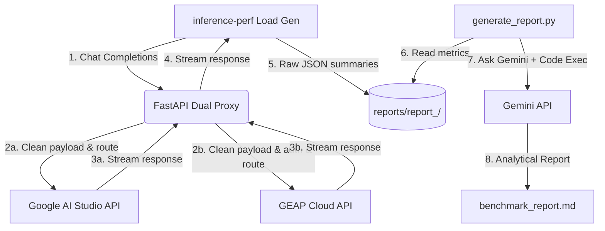

# Gemini Multi-Surface Performance Benchmark: Google AI Studio vs. GEAP

A streamlined systems benchmark harness to measure, compare, and analyze the performance, latency, and throughput of Google Gemini models across two developer surfaces:

1. **Google AI Studio (AIS):** The developer-centric fast-path API surface.
2. **Gemini Enterprise Agent Platform (GEAP):** The enterprise-grade isolated-tenant cloud platform.

Measures **Time to First Token (TTFT)**, **Time to Last Token (TTLT)**, **Tokens Per Second (TPS)**, and multimodal throughput under realistic concurrent load.

> [!NOTE]
> This codebase was largely developed with AI assistance using Antigravity.

---

## ⚡ Quickstart

Everything runs with a single command via [`run_benchmarks.sh`](file:///usr/local/google/home/janemalalane/Developer/ais_vs_geap/run_benchmarks.sh).

### 1. Setup & Environment

```bash
# Install dependencies & activate virtual environment
uv sync
source .venv/bin/activate

# Extract the ShareGPT benchmark dataset
unzip configs/ShareGPT_V3_unfiltered_cleaned_split.zip -d configs/

# Configure credentials
cp .env.example .env
```

Update `.env` with your credentials:
* `PROJECT_ID`: Your Google Cloud Project ID (required for GEAP).
* `API_KEY`: Your Gemini API Key (required for Google AI Studio & report generation).
* `AUTH_TOKEN`: *(Optional)* GCloud OAuth token. If omitted, [`run_benchmarks.sh`](file:///usr/local/google/home/janemalalane/Developer/ais_vs_geap/run_benchmarks.sh) fetches it dynamically via `gcloud auth print-access-token`.

---

### 2. Run the Benchmark

Execute the complete benchmark suite with one command:

```bash
./run_benchmarks.sh
```

**What this does automatically:**
1. ✅ **Proxy Management:** Starts and health-checks the [`dual_proxy.py`](file:///usr/local/google/home/janemalalane/Developer/ais_vs_geap/dual_proxy.py) gateway in the background (and cleanly stops it on completion).
2. 🔑 **Authentication:** Automatically fetches and refreshes OAuth tokens for GEAP and passes the API key for AI Studio.
3. 📁 **Isolation:** Creates a timestamped output directory (`reports/report_<timestamp>/`) with dedicated `ai_studio/` and `geap/` subfolders.
4. ⏱️ **Sequential Execution:** Executes each benchmark sequentially to eliminate host contention and CPU/memory bottlenecks.
5. 📊 **Report Synthesis:** Invokes Gemini with Python Code Execution via [`generate_report.py`](file:///usr/local/google/home/janemalalane/Developer/ais_vs_geap/gemini_report_synthesis/generate_report.py) to synthesize an analytical markdown report (`benchmark_report.md`).

---

## 🎯 Targeted Runs (Filters)

You can run specific subsets of benchmarks by passing an argument to [`run_benchmarks.sh`](file:///usr/local/google/home/janemalalane/Developer/ais_vs_geap/run_benchmarks.sh):

```bash
# Run all benchmark configurations (default)
./run_benchmarks.sh

# Run only standard text workloads (Flash, Lite, Pro across generations)
./run_benchmarks.sh text

# Run only multimodal image workloads
./run_benchmarks.sh image

# Run a single specific configuration
./run_benchmarks.sh config_ai_studio_gemini_3.7_flash.yaml
```

---

## 📊 Viewing & Re-synthesizing Reports

Each run produces raw JSON telemetry and an executive comparison report in `reports/report_<timestamp>/`:

```
reports/report_YYYYMMDD_HHMMSS/
├── ai_studio/              # Raw inference-perf metrics & JSON summaries
├── geap/                   # Raw inference-perf metrics & JSON summaries
└── benchmark_report.md     # Synthesized Gemini comparison report
```

To re-run the Gemini analysis or synthesize a report for an existing run directory:

```bash
# Automatically analyze the latest run in reports/
python gemini_report_synthesis/generate_report.py

# Target a specific past run directory
python gemini_report_synthesis/generate_report.py --run-dir reports/report_20260824_183558
```

---

## 📐 Architecture



### Core Components
* **[`dual_proxy.py`](file:///usr/local/google/home/janemalalane/Developer/ais_vs_geap/dual_proxy.py):** OpenAI-compatible proxy that normalizes payloads, handles surface-specific auth, and streams responses.
* **`inference-perf`:** LLM load generator executing standard ShareGPT prompt distributions.
* **[`generate_report.py`](file:///usr/local/google/home/janemalalane/Developer/ais_vs_geap/gemini_report_synthesis/generate_report.py):** Automated report generator using Gemini and Python code execution for mathematical audits of TTFT, TTLT, TPS, tail percentiles (p50, p90, p99), and deltas.
