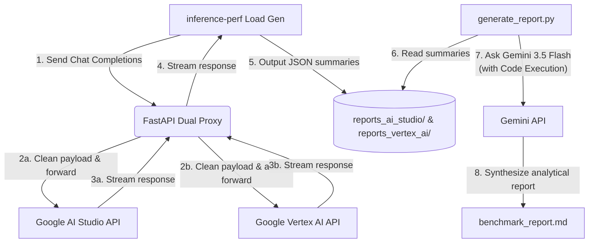

# 🚀 Gemini Multi-Surface Performance Benchmark: Google AI Studio vs. Vertex AI (GEAP)

This repository provides a rigorous systems-engineering benchmark harness to measure, compare, and analyze the performance, latency, and reliability of Google Gemini models across two developer surfaces:

1. **Google AI Studio (AIS):** The developer-centric fast-path API surface.
2. **Google Vertex AI (Google Enterprise AI Platform / GEAP):** The enterprise-grade isolated-tenant cloud platform.

Using concurrent load generation (`inference-perf`), a custom payload sanitization proxy (`dual_proxy.py`), and LLM-powered telemetry synthesis (`generate_report.py`), this toolchain compares performance metrics including **Time to First Token (TTFT)**, **Time to Last Token (TTLT)**, **Tokens Per Second (TPS)**, and multimodal throughput under realistic concurrent load profiles.

---

## 📐 Architecture & Telemetry Pipeline

The benchmarking workflow operates as a closed-loop collection and analysis pipeline:



### Core Components

*   **FastAPI Dual Proxy (`dual_proxy.py`):** Acts as an OpenAI-compatible gateway. It intercepts requests from `inference-perf`, strips payload parameters incompatible with Gemini endpoints (like `"ignore_eos"`), manages authorization (injecting Bearer tokens for Vertex AI or keys for AI Studio), prepends namespaces where required, and streams raw bytes back to the load generator.
*   **Load Generator (`inference-perf`):** An LLM load generation framework that replays traffic based on a cleaned ShareGPT dataset (`configs/ShareGPT_V3_unfiltered_cleaned_split.json` — unzipped from `configs/ShareGPT_V3_unfiltered_cleaned_split.zip`) utilizing configurable load patterns (constant rate or multi-stage ramps).
*   **Report Synthesizer (`generate_report.py`):** An advanced analytics tool that harvests JSON telemetry from both surfaces, aggregates the data, and invokes a Gemini model (e.g., `gemini-3.5-flash`) equipped with **Python Code Execution** to run precise mathematical audits (means, medians, p99 tail latencies, throughput percentage deltas, and error-to-success ratios) and write a unified, systems-grade comparative report.

---

## 🛠️ Prerequisites & Setup

This repository uses [uv](https://github.com/astral-sh/uv) for fast, robust Python dependency management.

### 1. Installation & Dataset Preparation
Install the project dependencies, activate the virtual environment, and unzip the large ShareGPT dataset:

```bash
# Sync dependencies and build virtual environment
uv sync

# Activate the virtual environment
source .venv/bin/activate

# Unzip the ShareGPT dataset
unzip configs/ShareGPT_V3_unfiltered_cleaned_split.zip -d configs/
```

### 2. Environment Configuration
Copy the template `.env.example` file and populate it with your credentials:

```bash
cp .env.example .env
```

Open `.env` in your editor and provide values for:
*   `PROJECT_ID`: Your Google Cloud Project ID (required for Vertex AI).
*   `API_KEY`: Your Gemini API Key (required for Google AI Studio).
*   `AUTH_TOKEN`: Your Google Cloud OAuth access token (required for Vertex AI).
    *   *Tip:* You can retrieve a temporary token via CLI: `gcloud auth print-access-token`

---

## 🏃 Running Benchmarks

Benchmarking is executed in two steps: starting the middleware proxy, and then launching the load generator config.

### Step 1: Start the Dual Proxy Gateway
The proxy must be running locally to translate and forward incoming request traffic:

```bash
uvicorn dual_proxy:app --host 127.0.0.1 --port 8000 > proxy.log 2>&1 &
```

> [!NOTE]
> The proxy runs on port `8000`. You can inspect raw gateway interactions or check error logs in `proxy.log`.

### Step 2: Run a Load Configuration
Execute a benchmark sweep using a configuration file from the `configs/` directory. For example, to benchmark **Gemini 3.5 Flash** on **Google AI Studio**:

```bash
export $(cat .env | xargs) && inference-perf --config <(envsubst < configs/config_ai_studio_gemini_3.5_flash.yaml)
```

To run the comparative suite on **Google Vertex AI**:

```bash
export $(cat .env | xargs) && inference-perf --config <(envsubst < configs/config_vertex_ai_gemini_3.5_flash.yaml)
```

### Available Configurations
The `configs/` directory contains standard load-testing profiles (rates, duration stages, tokenizers, and endpoints) tailored for both developer surfaces:
*   **Standard Text workloads:** Tests flash, lite, and pro models across generations 2.5, 3.1, and 3.5.
*   **Multimodal workloads:** Specifically targets heavy multi-token visual inputs (using the suffix `_image_multimodal`).

---

## 📊 Synthesizing the Performance Report

Once you have accumulated JSON metrics in `reports_ai_studio/` and `reports_vertex_ai/`, you can auto-generate a comprehensive markdown report. The synthesis script uses Gemini with native code execution to ensure calculations are mathematically correct:

```bash
python gemini_report_synthesis/generate_report.py 
```
